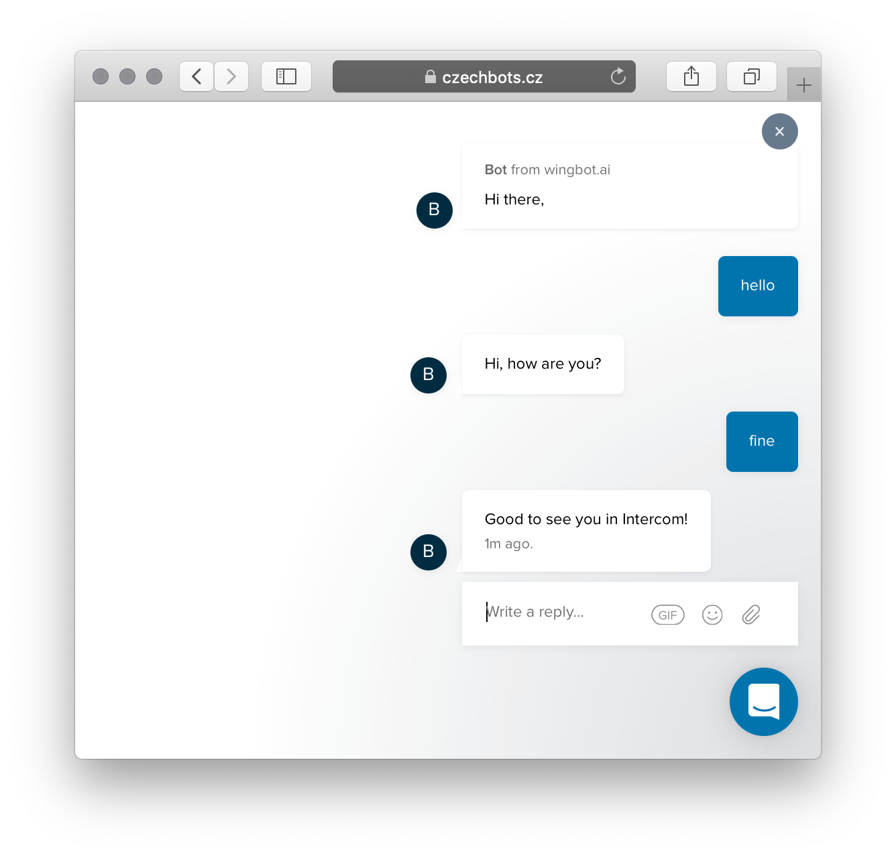

# Intercom connector for wingbot.ai bot

It's easy now to use the wingbot.ai as an automation backend for Intercom.



## Setting up the Intercom

1. **Create an Intercom application**

    you'll get an access token, which you'll be able to use as `intercomAppToken`.

2. **Set up the webhook**

    Subscribe the bot to following channels

    - `conversation.user.created`
    - `conversation.user.replied`
    - `conversation.admin.assigned`

3. **Create a Bot admin user**

    You'll use an ID of the user as a `botAdminId` param.

4. **Make additional setup**

    These steps are required to make the bot working properly:

    - set the Bot admin user as a default assignee
    - turn off the work hours
    - set up the welcome message for all chat users

5. **Use team (or admin user) ID as a Handover app ID**

    To pass thread to team or user use it's ID as an application ID in pass thread command.

## Setting up the bot

And don't forget to **disable `autoTyping` and `autoSeen` feature and all handover related interactions.**

```javascript
const { Router, Bot } = require('wingbot');
const { Intercom } = require('wingbot-intercom');

const bot = new Bot();

const processor = new Processor(bot);

const intercom = new Intercom(processor, {
    botAdminId: '123',
    intercomAppToken: '456'
});

// the route
module.exports.bot = async (req, res) => {
    const { body, headers } = req;

    await intercom.verifyRequest(body, headers);

    await intercom.processEvent(body);
};
```

-----------------

# API
## Classes

<dl>
<dt><a href="#Intercom">Intercom</a></dt>
<dd><p>BotService connector for wingbot.ai</p>
</dd>
</dl>

## Typedefs

<dl>
<dt><a href="#Processor">Processor</a> : <code>Object</code></dt>
<dd></dd>
</dl>

<a name="Intercom"></a>

## Intercom
BotService connector for wingbot.ai

**Kind**: global class  

* [Intercom](#Intercom)
    * [new Intercom(processor, options, [senderLogger])](#new_Intercom_new)
    * [.processEvent(body)](#Intercom+processEvent) ⇒ <code>Promise.&lt;Array.&lt;{message:object, pageId:string}&gt;&gt;</code>
    * [.verifyRequest(body, headers)](#Intercom+verifyRequest) ⇒ <code>Promise</code>

<a name="new_Intercom_new"></a>

### new Intercom(processor, options, [senderLogger])

| Param | Type | Description |
| --- | --- | --- |
| processor | [<code>Processor</code>](#Processor) | wingbot Processor instance |
| options | <code>object</code> |  |
| options.botAdminId | <code>string</code> | id of the bot user in Intercom |
| options.intercomAppToken | <code>string</code> | OAUTH token to authorize Intercom requests |
| [options.passThreadAction] | <code>string</code> | trigger this action for pass thread event |
| [options.requestLib] | <code>function</code> | request library replacement for testing |
| [options.uri] | <code>string</code> | override intercom URL |
| [senderLogger] | <code>console</code> | optional console like chat logger |

<a name="Intercom+processEvent"></a>

### intercom.processEvent(body) ⇒ <code>Promise.&lt;Array.&lt;{message:object, pageId:string}&gt;&gt;</code>
Process Facebook request

**Kind**: instance method of [<code>Intercom</code>](#Intercom)  
**Returns**: <code>Promise.&lt;Array.&lt;{message:object, pageId:string}&gt;&gt;</code> - - unprocessed events  

| Param | Type | Description |
| --- | --- | --- |
| body | <code>object</code> | event body |

<a name="Intercom+verifyRequest"></a>

### intercom.verifyRequest(body, headers) ⇒ <code>Promise</code>
Verify Facebook webhook event

**Kind**: instance method of [<code>Intercom</code>](#Intercom)  
**Throws**:

- <code>Error</code> when authorization token is invalid or missing


| Param | Type | Description |
| --- | --- | --- |
| body | <code>string</code> \| <code>Buffer</code> | parsed request body |
| headers | <code>object</code> | request headers |

<a name="Processor"></a>

## Processor : <code>Object</code>
**Kind**: global typedef  

| Param | Type |
| --- | --- |
| processMessage | <code>function</code> | 

